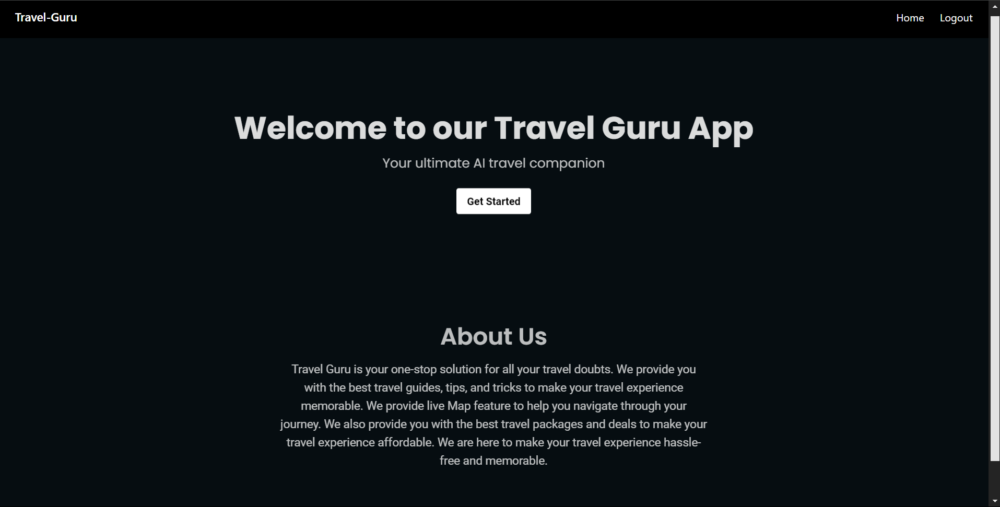
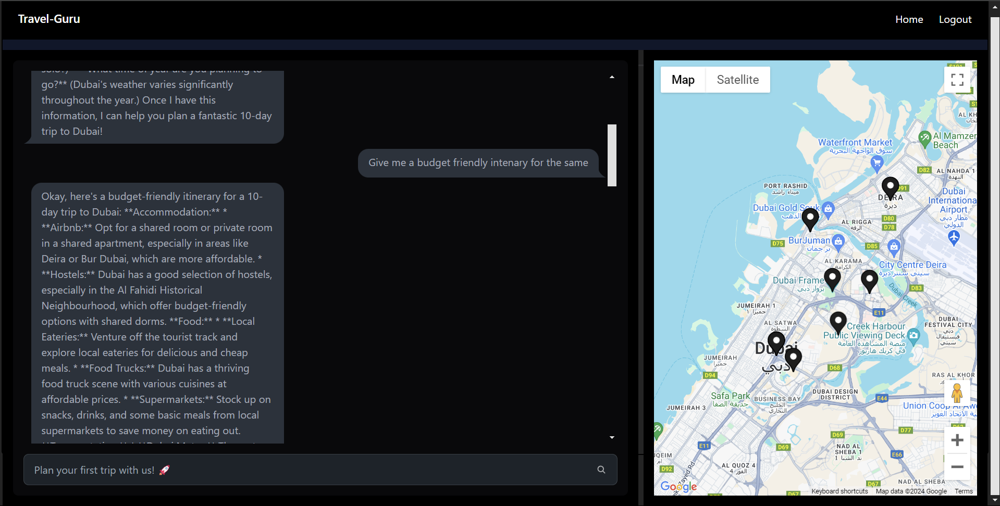
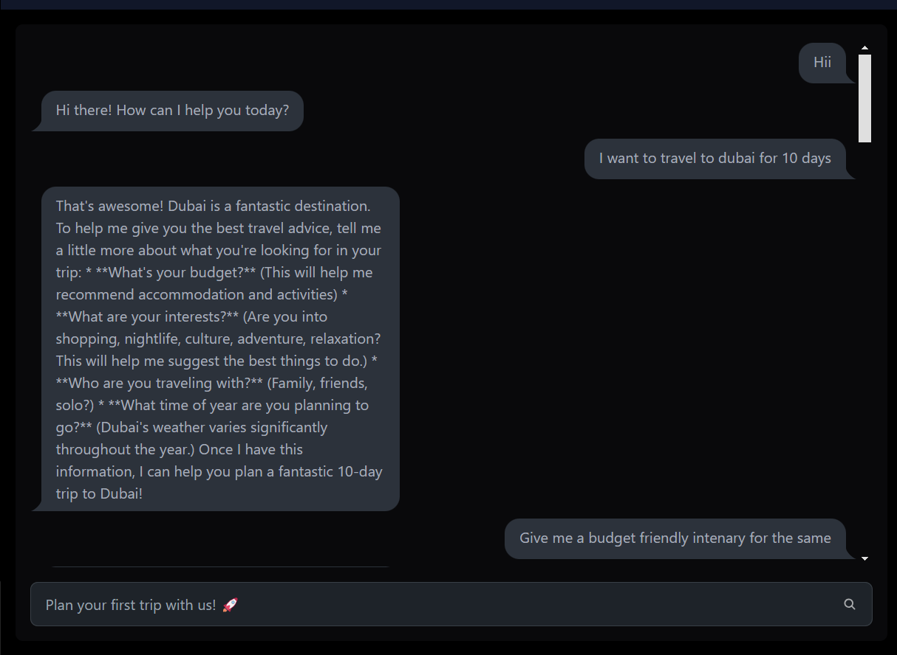
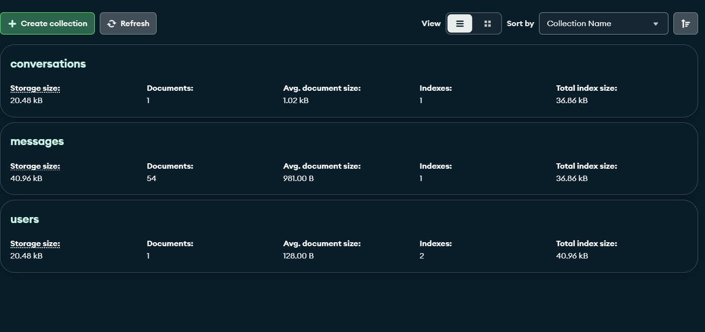
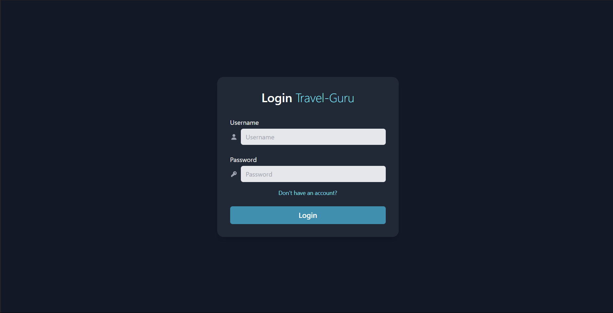
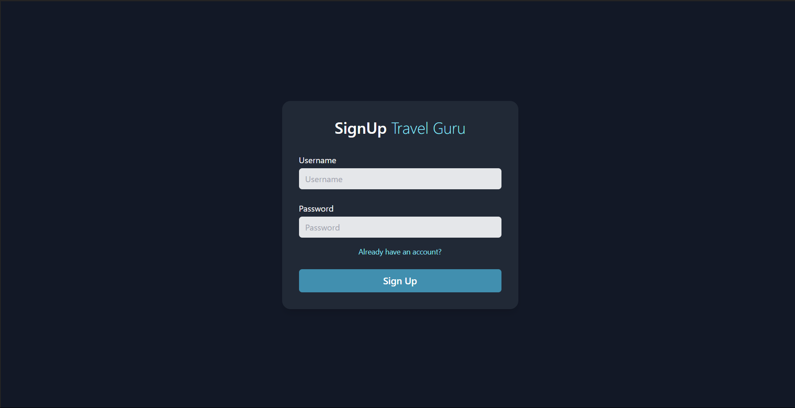

# Travel Guru

[](https://travel-guru-vert.vercel.app/)

## Table of Contents
- [Description](#description)
- [Snapshots](#snapshots)
- [Features](#features)
- [Installation](#installation)
- [Usage](#usage)
- [Contributing](#contributing)
- [License](#license)
- [Contact](#contact)

## Description
Travel Guru is a comprehensive travel planning application built with React and Vite and nodejs in backgroud. It provides users with a customized ai chatbot and interactive google maps to plan their trips efficiently. The pins on Google maps comes accordingly with the places the AI bot references with.

## Snapshots
Here are some snapshots of Travel Guru:


*Homepage*


*Travel-Guru*


*Chat-Section*


*Databse Models*


*Login*


*Sign-Up*

## Features
- User-friendly interface
- Trip planning tools
- Destination information and recommendations
- Interactive maps
- Responsive design

## Installation
To set up the project locally, follow these steps:

1. **Clone the repository:**
    ```sh
    git clone https://github.com/pra2107tham/Travel-Guru.git
    ```
2. **Navigate to the project directory:**
    ```sh
    cd Travel-Guru
    ```
3. **Install dependencies:**
    ```sh
    npm install
    ```
4. **Run the development server:**
    ```sh
    npm run dev
    ```

## Usage
After setting up, you can access the application at `http://localhost:3000`. Use the app to explore travel destinations, plan your trips, and manage travel itineraries.

## Contributing
Contributions are welcome! To contribute:

1. Fork the repository
2. Create a new branch (`git checkout -b feature-branch`)
3. Make your changes
4. Commit your changes (`git commit -m 'Add some feature'`)
5. Push to the branch (`git push origin feature-branch`)
6. Open a pull request

## License
This project is licensed under the MIT License. See the [LICENSE](LICENSE) file for details.

## Contact
For any inquiries, please reach out at `your-email@example.com`.
